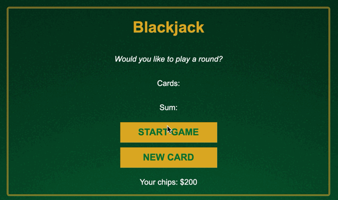

# Simple Blackjack
Building a little blackjack game with HTML, CSS, and good ol' vanilla javaScript...

So far, I have a VERY basic working version of this game. Starting the game, you are "dealt" two random cards and you can choose to draw another card until you get blackjack or go over 21, at which point you are out of the game. The cards are stored in an array which is rendered screen with a for loop.

Next steps:
 - decrease chips (bet) when starting game
 - win double the chips you "bet" when you get blackjack
 - create dealers variables
  - dealersCards
  - dealersSum
  - dealers
 - maybe just making objects for player and dealer